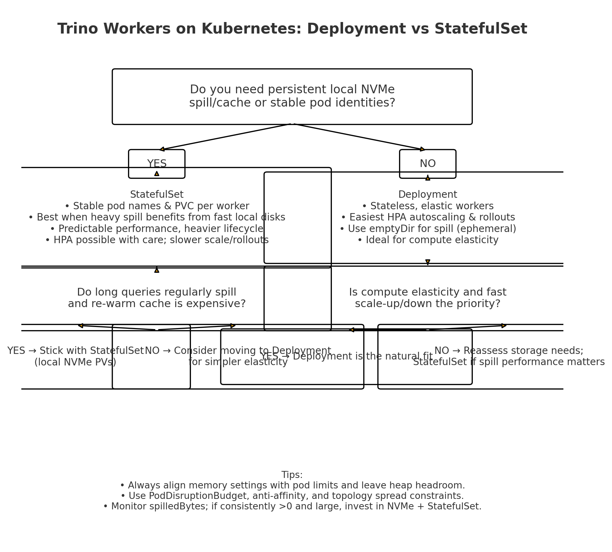

Deployment
	•	Nature: Stateless, ephemeral pods.
	•	Best for: Elastic compute, autoscaling, rolling upgrades.
	•	Storage: emptyDir (ephemeral), usually fine since Trino is memory-first.
	•	Scaling: Native support for Horizontal Pod Autoscaler (HPA).
	•	Use case: Most Trino clusters where workers act as pure compute engines and queries fit in memory or tolerate ephemeral spill.
	•	Why: Matches Trino’s design (stateless workers, coordinator reschedules tasks).

⸻

StatefulSet
	•	Nature: Stable pod identity + persistent volumes (PVCs).
	•	Best for: Workers that need node-local SSD/NVMe for spill, cache, or shuffle survival across restarts.
	•	Storage: volumeClaimTemplates for binding local PVs.
	•	Scaling: Slower, heavier lifecycle; less natural for HPA.
	•	Use case: Specialized clusters for long-running, data-intensive queries where disk spill performance is critical.
	•	Why: Ensures each worker keeps the same volume + hostname, improving predictable performance.

⸻

🚦 Rule of Thumb
	•	Deployment → default, fits query engine residency (elastic, stateless, cloud-native).
	•	StatefulSet → niche, only if fast local NVMe spill/cache is essential.

⸻

👉 In short:
Trino = query engine = compute elasticity ⇒ Deployment is the natural fit.
StatefulSet is an optimization for special workloads that push beyond memory into heavy spill.

